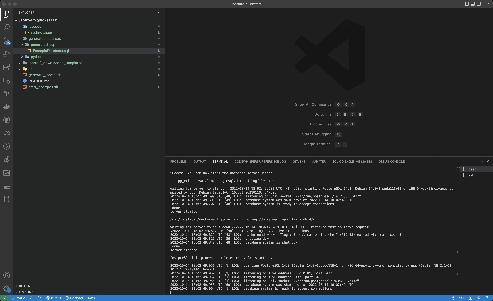
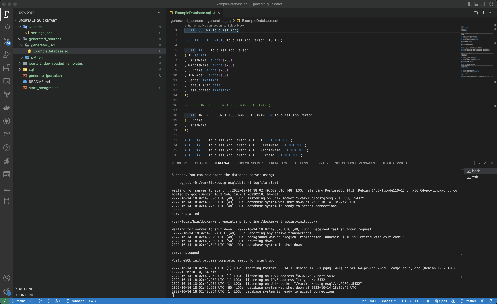

## Creating our first simple table definition: *ToDoList*

### Create the SI file  
Create a file called todolist.si in the ${rootDir}/sql/si directory created above. SI files are the input files to JPortal2.

Your structure should now look like this:
```
jportal2-demo
└───.vscode
    └── settings.json
└───sql
    └───si
        └── todolist.si
```


The todolist.si file should contain the following code:

**todolist.si**
```sql
DATABASE ExampleDatabase
PACKAGE com.example.db
SERVER ExampleServer
SCHEMA ToDoList_App

TABLE ToDoList
   ID               SEQUENCE
   ListName         CHAR(255)
   ListType         SHORT (Private=1, Public=2)
   Description      CHAR(255)
   LastUpdated      TIMESTAMP

KEY PKEY PRIMARY
    ID

//Simple CRUD queries are available out of the box with JPortal2
PROC Insert Returning
PROC Update
PROC SelectOne
PROC DeleteOne

//You can put take-on or test data in this section
SQLDATA
INSERT INTO ToDoList_App.ToDoList(ListName,ListType,Description,LastUpdated) VALUES ('Takeon Test List 1', 1, 'Take on test list description', CURRENT_DATE )
ENDDATA


```
The above file does quite a lot, in a small amount of code:  

* **Line 1** tells JPortal2 that you want to create a database called ExampleDatabase. Depending on the generator, this line may or may not be used.      
* **Line 2** tells JPortal2 to put the code generated from this file, into a namespace/package called com.example.db  
* **Line 3** tells JPortal2 that this code will be running in a microservice called ExampleServer. For the majority of your use cases, this is not important - this is really used for other private-source generators (not available to the public) that build off of JPortal2  
* **Line 5-11** tells JPortal2 we want to create a database table called TodoList, with 5 fields, as well as the types of the fields. See <TODO> for a full list of field types supported. The only interesting thing to note here, is that we are defining the ListType field as a SHORT, but we are also specifying that we want an Enum for the field, which contains two values, "Private" and "Public". More on this later.  
* **Line 13-14** tells JPortal2 we want to create a key called PKEY. It will be of type `PRIMARY` (in other words a primary key) and consist of a single field, in this case the `ID` field.   
* **Line 17-20** tells JPortal2 we want to generate code for 4 simple CRUD operations:  
    * an `Insert` function that will give us back the inserted primary (because we specified the keyword `Returning`)
    * An `Update` function that will take all the fields (except for the Primary Key), and update them.  
    * A `SelectOne` function that selects a record by Primary Key, and returns all of the fields  
    * A `DeleteOne` function that will delete a record by Primary Key
* **Line 22-25** is completely optional, but is a simple way to insert take-on data into our database for testing. It takes the lines that are between the tokens `SQLDATA` and `ENDDATA` and puts them verbatim into the generated files as we'll see below.

Indenting and spacing generally doesn't matter, but try to indent to keep your code readable.

**!!!NOTE!!!:** There is unfortunately one gotcha (bug) in JPortal2, you do need to have an empty line at the end of your SI file. This is a side-effect of how our parser works, and seems to be an elusive bug to fix. So for now, just remember to leave an empty line at the end of your SI file. 

### Generate PostgreSQL DDL from our SI file
Now, run the JPortal2 docker command, to generate a PostgreSQL DDL file:

```shell
docker run --rm -v ${PWD}:/local ghcr.io/si-gen/jportal2:latest \
                      --inputdir=/local/sql/si \
                      --builtin-generator PostgresDDL:/local/generated_sources/generated_sql
```

**PRO-TIP: For ease-of-use, we usually create a file named generate_jportal.sh in the root directory, which contains the above command-line.**

You will notice that we are passing 2 command-line parameters to JPortal2:  
The `--inputdir` parameter tells JPortal2 where the SI files are located.  
The `--builtin-generator` parameter tells JPortal2 that we want to run the built-in generator named PostgresDDL, and place the generated output files in the directory `generated_sources/generated_sql`  

After running the above command, you should see some console output, and then a freshly-generated file in the ${rootDir}/generated_sources/generate_sql/ directory. The file will be named **ExampleDatabase.sql** (because we specified the database name as `ExampleDatabase` in line one of the above SI file).  
The file should look as per below:  

**ExampleDatabase.sql**
```postgresql
DROP TABLE IF EXISTS ToDoList_App.Person CASCADE;

CREATE TABLE ToDoList_App.Person
( ID serial
  , FirstName varchar(255)
  , MiddleName varchar(255)
  , Surname varchar(255)
  , IDNumber varchar(50)
  , Gender smallint
  , DateOfBirth date
  , LastUpdated timestamp
);

-- DROP INDEX PERSON_IDX_SURNAME_FIRSTNAME;

CREATE INDEX PERSON_IDX_SURNAME_FIRSTNAME ON ToDoList_App.Person
  ( Surname
    , FirstName
    );

ALTER TABLE ToDoList_App.Person ALTER ID SET NOT NULL;
ALTER TABLE ToDoList_App.Person ALTER FirstName SET NOT NULL;
ALTER TABLE ToDoList_App.Person ALTER MiddleName SET NOT NULL;
ALTER TABLE ToDoList_App.Person ALTER Surname SET NOT NULL;
ALTER TABLE ToDoList_App.Person ALTER IDNumber SET NOT NULL;
ALTER TABLE ToDoList_App.Person ALTER Gender SET NOT NULL;
ALTER TABLE ToDoList_App.Person ALTER DateOfBirth SET NOT NULL;
ALTER TABLE ToDoList_App.Person ALTER LastUpdated SET NOT NULL;

ALTER TABLE ToDoList_App.Person
  ADD CONSTRAINT PERSON_PKEY PRIMARY KEY
    ( ID
      )
;
ALTER TABLE ToDoList_App.Person
  ADD CONSTRAINT PERSON_UNQ_IDNUMBER UNIQUE
    ( IDNumber
      )
;

INSERT INTO ToDoList_App.Person(FirstName,MiddleName,Surname,IDNumber,Gender, DateOfBirth, LastUpdated)
VALUES ('Johnny', 'B.', 'Goode','0000000000',1,'1960-01-01' CURRENT_DATE );
INSERT INTO ToDoList_App.Person(FirstName,MiddleName,Surname,IDNumber,Gender, DateOfBirth, LastUpdated)
VALUES ('Johnny', '', 'Dangerously','1111111111',1,'1970-01-01' CURRENT_DATE );
INSERT INTO ToDoList_App.Person(FirstName,MiddleName,Surname,IDNumber,Gender, DateOfBirth, LastUpdated)
VALUES ('A', 'N', 'Other','2222222222',2,'1980-10-10' CURRENT_DATE );
INSERT INTO ToDoList_App.Person(FirstName,MiddleName,Surname,IDNumber,Gender, DateOfBirth, LastUpdated)
VALUES ('Fee', 'Fi', 'Fofum','3333333333',3,'1940-04-04' CURRENT_DATE );

DROP TABLE IF EXISTS ToDoList_App.ToDo_Item CASCADE;

CREATE TABLE ToDoList_App.ToDo_Item
( ID serial
  , TodoList_ID integer
  , ItemName varchar(255)
  , ItemDescription text
  , LastUpdated timestamp
);

ALTER TABLE ToDoList_App.ToDo_Item ALTER ID SET NOT NULL;
ALTER TABLE ToDoList_App.ToDo_Item ALTER TodoList_ID SET NOT NULL;
ALTER TABLE ToDoList_App.ToDo_Item ALTER ItemName SET NOT NULL;
ALTER TABLE ToDoList_App.ToDo_Item ALTER ItemDescription SET NOT NULL;
ALTER TABLE ToDoList_App.ToDo_Item ALTER LastUpdated SET NOT NULL;

ALTER TABLE ToDoList_App.ToDo_Item
  ADD CONSTRAINT TODO_ITEM_PKEY PRIMARY KEY
    ( ID
      )
;

DROP TABLE IF EXISTS ToDoList_App.ToDoList CASCADE;

CREATE TABLE ToDoList_App.ToDoList
( ID serial
  , ListName varchar(255)
  , ListType smallint
  , Description varchar(255)
  , LastUpdated timestamp
);

ALTER TABLE ToDoList_App.ToDoList ALTER ID SET NOT NULL;
ALTER TABLE ToDoList_App.ToDoList ALTER ListName SET NOT NULL;
ALTER TABLE ToDoList_App.ToDoList ALTER ListType SET NOT NULL;
ALTER TABLE ToDoList_App.ToDoList ALTER Description SET NOT NULL;
ALTER TABLE ToDoList_App.ToDoList ALTER LastUpdated SET NOT NULL;

ALTER TABLE ToDoList_App.ToDoList
  ADD CONSTRAINT TODOLIST_PKEY PRIMARY KEY
    ( ID
      )
;

INSERT INTO ToDoList_App.ToDoList(ListName,ListType,Description,LastUpdated) VALUES ('Takeon Test List 1', 1, 'Take on test list description', CURRENT_DATE )


```
The above file should be completely self-explanatory, however we will add a few comments here:  
1. The above DDL file is meant to facilitate easy creation of a local test database for developers. You will most likely use it to create an initial test database to play with, but once you start getting into the proper SDLC, and start creating DEV, QA and PROD database, you will use the file as an example or helper to write your own Flyway or Liquibase scripts. It isn't meant to just use as-is in one of these tools.  
2. Notice **line 23**, which contains the take-on data that we specified at the bottom of the **todolist.si** file above. As mentioned previously, this can be a quick and easy way to get test data into your database.

### Create our tables in the database  
To run our DDL, we will use the VSCode SQLTools extension we installed [here](getting-started-in-postgres.md).  
Open the `generated_sources/generated_sql/ExampleDatabase.sql` file by double-clicking on it.  

Now press `Ctrl-P` to open the command palette, and type `SQLTools Run`, choose the `SQLTools Connection: Run this file` option:


Finally, to check that our table was created, go to the SQLTools extension on the left, open the postgres connection, 
and navigate to the right schema and table:



Works like magic, doesn't it? :)


*"OK, so we can generate DDL using the above mechanism,"* I hear you say, *"But what about the type-safe code you promised me? Where is all my Python, C#, or Java goodness? What is the point of this?".* 

Your point is completely valid - DDL is not hard to write, and you do it once. But you interact with the database from code every day. Fear not, we will get to that next.

### Generate Python code

To generate Python code, we will make use of a JPortal *template-generator* named the `jportal2-generator-vanguard-sqlalchemy` template.

Generators, specifically template generators, are a topic all on their own. You can read more about generators (including the difference between built-in and template generators) in < TODO >, but for now, just continue reading below, and follow the instructions. 

Type the following command:
```shell
docker run --rm -v ${PWD}:/local ghcr.io/si-gen/jportal2:latest \
                      --inputdir=/local/sql/si \
                      --builtin-generator PostgresDDL:/local/generated_sources/generated_sql \
                      --template-generator SQLAlchemy:/local/generated_sources/python/sqlalchemy \
                      --download-template "SQLAlchemy:https://github.com/SI-Gen/jportal2-generator-vanguard-sqlalchemy/archive/refs/tags/1.3.zip|stripBaseDir"
```

You will notice that the command line looks very similar to the previous one we ran, but it has 2 additional lines.  
**Line 4** is very similar to line 3. It tells JPortal you want to run the template-generator name SQLAlchemy, and place the generated output files in the directory `generated_sources/python/sqlalchemy`  
**line 5** is a little different. It tells JPortal where to find and download the SQLAlchemy generator we refer to in line 4, from. *For more information about using downloading template generators, and how and why you would want to do that, see < TODO >*

Now, navigate to the directory `generated_sources/python/sqlalchemy`. You should see a freshly generated file there, named `db_ToDoList.py`. This is the file that was generated by the SQLAlchemy generator. Let's have a look at the contents of the file:

**db_ToDoList.py**
```python
########################################################################################################################
################## Generated Code. DO NOT CHANGE THIS CODE. Change it in the generator and regenerate ##################
########################################################################################################################

from dataclasses import dataclass, field
from datetime import datetime
from typing import List, Any, Optional
import enum
import sqlalchemy as sa
from sqlalchemy.orm import Session
from sqlalchemy.sql.expression import TextAsFrom

from bbdcommon.database.db_common import DBMixin, Base, DBColumn
from bbdcommon.database import db_types
from bbdcommon.database.processing import process_result_recs, process_result_rec, process_bind_params


TODOLIST_SCHEMA = "todolist_app"
class DB_ToDoList(Base, DBMixin):
  # Enum for ListType field
  class ListTypeEnum(enum.Enum):
    Private = 1
    Public = 2

    @classmethod
    def process_result_value_cls(cls, value, dialect):
      return DB_ToDoList.ListTypeEnum(value)


  ID: int = DBColumn("id", sa.Integer(), sa.Sequence("todolist_id_seq", metadata=Base.metadata, schema=TODOLIST_SCHEMA), primary_key=True, autoincrement=False)
  ListName: str = DBColumn("listname", db_types.NonNullableString(length=255))
  ListType: ListTypeEnum = DBColumn("listtype", sa.SmallInteger())
  Description: str = DBColumn("description", db_types.NonNullableString(length=255))
  LastUpdated: datetime = DBColumn("lastupdated", sa.DateTime(), default=datetime.now, onupdate=datetime.now)

  __schema__ = TODOLIST_SCHEMA

  def __init__(self, ListName: str, ListType: ListTypeEnum, Description: str, LastUpdated: datetime):
    super(DB_ToDoList, self).__init__(
      ListName=ListName,
      ListType=ListType.value if isinstance(ListType, enum.Enum) else ListType,
      Description=Description,
      LastUpdated=LastUpdated)
  # Insert yes

@dataclass
class DB_ToDoListInsertReturning:
  # Enum for ListType field
  class ListTypeEnum(enum.Enum):
    Private = 1
    Public = 2

    @classmethod
    def process_result_value_cls(cls, value, dialect):
      return DB_ToDoListInsertReturning.ListTypeEnum(value)


  #Outputs
  ID: int

  @classmethod
  def get_statement(cls
                    , ListName: str
                    , ListType: ListTypeEnum
                    , Description: str
                    , LastUpdated: datetime
                    ) -> TextAsFrom:
    class _ret:
      sequence = "default," #postgres uses default for sequences
      output = ""
      tail = " RETURNING ID"
      #session.bind.dialect.name

    statement = sa.text(
      f"/* PROC ToDoList_App.ToDoList.Insert */"
      f"insert into ToDoList_App.ToDoList ("
      f"  ID,"
      f"  ListName,"
      f"  ListType,"
      f"  Description,"
      f"  LastUpdated"
      f" ) "
      f"{_ret.output}"
      f" values ("
      f"{_ret.sequence}"
      f"  :ListName,"
      f"  :ListType,"
      f"  :Description,"
      f"  :LastUpdated"
      f" )"
      f"{_ret.tail}")

    text_statement = statement.columns(ID=sa.types.Integer,
                                       )
    text_statement = text_statement.bindparams(ListName=ListName,
                                               ListType=ListType,
                                               Description=Description,
                                               LastUpdated=LastUpdated,
                                               )
    return text_statement

  @classmethod
  def execute(cls, session: Session, ListName: str
              , ListType: ListTypeEnum
              , Description: str
              , LastUpdated: datetime
              ) -> Optional['DB_ToDoListInsertReturning']:
    params = process_bind_params(session, [db_types.NonNullableString,
                                           sa.types.SmallInteger,
                                           db_types.NonNullableString,
                                           sa.types.DateTime,
                                           ], [ListName,
                                               ListType.value if isinstance(ListType, enum.Enum) else ListType,
                                               Description,
                                               LastUpdated,
                                               ])
    res = session.execute(cls.get_statement(*params))
    rec = res.fetchone()
    if rec:
      res.close()
      return process_result_rec(DB_ToDoListInsertReturning, session, [sa.types.Integer,
                                                                      ], rec)

    return None
  # Update yes

@dataclass
class DB_ToDoListUpdate:
  # Enum for ListType field
  class ListTypeEnum(enum.Enum):
    Private = 1
    Public = 2

    @classmethod
    def process_result_value_cls(cls, value, dialect):
      return DB_ToDoListUpdate.ListTypeEnum(value)


  @classmethod
  def get_statement(cls
                    , ListName: str
                    , ListType: ListTypeEnum
                    , Description: str
                    , LastUpdated: datetime
                    , ID: int
                    ) -> TextAsFrom:
    class _ret:
      sequence = "default," #postgres uses default for sequences
      output = ""
      tail = ""
      #session.bind.dialect.name

    statement = sa.text(
      f"update ToDoList_App.ToDoList"
      f" set"
      f"  ListName = :ListName"
      f", ListType = :ListType"
      f", Description = :Description"
      f", LastUpdated = :LastUpdated"
      f" where ID = :ID")

    text_statement = statement.columns()
    text_statement = text_statement.bindparams(ListName=ListName,
                                               ListType=ListType,
                                               Description=Description,
                                               LastUpdated=LastUpdated,
                                               ID=ID,
                                               )
    return text_statement

  @classmethod
  def execute(cls, session: Session, ListName: str
              , ListType: ListTypeEnum
              , Description: str
              , LastUpdated: datetime
              , ID: int
              ) -> None:
    params = process_bind_params(session, [db_types.NonNullableString,
                                           sa.types.SmallInteger,
                                           db_types.NonNullableString,
                                           sa.types.DateTime,
                                           sa.types.Integer,
                                           ], [ListName,
                                               ListType.value if isinstance(ListType, enum.Enum) else ListType,
                                               Description,
                                               LastUpdated,
                                               ID,
                                               ])
    res = session.execute(cls.get_statement(*params))
    res.close()
  # SelectOne yes

@dataclass
class DB_ToDoListSelectOne:
  # Enum for ListType field
  class ListTypeEnum(enum.Enum):
    Private = 1
    Public = 2

    @classmethod
    def process_result_value_cls(cls, value, dialect):
      return DB_ToDoListSelectOne.ListTypeEnum(value)


  #Outputs
  ListName: str
  ListType: ListTypeEnum
  Description: str
  LastUpdated: datetime

  @classmethod
  def get_statement(cls
                    , ID: int
                    ) -> TextAsFrom:
    class _ret:
      sequence = "default," #postgres uses default for sequences
      output = " OUTPUT (ListName,ListType,Description,LastUpdated)"
      tail = " RETURNING ListName ListType Description LastUpdated"
      #session.bind.dialect.name

    statement = sa.text(
      f"/* PROC ToDoList_App.ToDoList.SelectOne */"
      f"select"
      f"  ListName"
      f", ListType"
      f", Description"
      f", LastUpdated"
      f" from ToDoList_App.ToDoList"
      f" where ID = :ID")

    text_statement = statement.columns(ListName=db_types.NonNullableString,
                                       ListType=sa.types.SmallInteger,
                                       Description=db_types.NonNullableString,
                                       LastUpdated=sa.types.DateTime,
                                       )
    text_statement = text_statement.bindparams(ID=ID,
                                               )
    return text_statement

  @classmethod
  def execute(cls, session: Session, ID: int
              ) -> Optional['DB_ToDoListSelectOne']:
    params = process_bind_params(session, [sa.types.Integer,
                                           ], [ID,
                                               ])
    res = session.execute(cls.get_statement(*params))
    rec = res.fetchone()
    if rec:
      res.close()
      return process_result_rec(DB_ToDoListSelectOne, session, [db_types.NonNullableString,
                                                                DB_ToDoListSelectOne.ListTypeEnum,
                                                                db_types.NonNullableString,
                                                                sa.types.DateTime,
                                                                ], rec)

    return None
  # DeleteOne yes

@dataclass
class DB_ToDoListDeleteOne:


  @classmethod
  def get_statement(cls
                    , ID: int
                    ) -> TextAsFrom:
    class _ret:
      sequence = "default," #postgres uses default for sequences
      output = ""
      tail = ""
      #session.bind.dialect.name

    statement = sa.text(
      f"/* PROC ToDoList_App.ToDoList.DeleteOne */"
      f"delete from ToDoList_App.ToDoList"
      f" where ID = :ID")

    text_statement = statement.columns()
    text_statement = text_statement.bindparams(ID=ID,
                                               )
    return text_statement

  @classmethod
  def execute(cls, session: Session, ID: int
              ) -> None:
    params = process_bind_params(session, [sa.types.Integer,
                                           ], [ID,
                                               ])
    res = session.execute(cls.get_statement(*params))
    res.close()
  #  no

@dataclass
class DB_ToDoListStaticData:


  @classmethod
  def get_statement(cls
                    ) -> TextAsFrom:
    class _ret:
      sequence = "default," #postgres uses default for sequences
      output = ""
      tail = ""
      #session.bind.dialect.name

    statement = sa.text(
      f"INSERT INTO ToDoList_App.ToDoList(ListName,ListType,Description,LastUpdated) VALUES ('Takeon Test List 1', 1, 'Take on test list description', CURRENT_DATE )")

    text_statement = statement.columns()
    return text_statement

  @classmethod
  def execute(cls, session: Session) -> None:
    res = session.execute(cls.get_statement())
    res.close()

```

Yikes! That's a lot of generated code! Fortunately, you will see a lot of it is simply repetition. This is one of the benefits of using a tool like JPortal2. Without it, you would have had to write all this code by hand.

Let's look at it, bit by bit.

```python
########################################################################################################################
################## Generated Code. DO NOT CHANGE THIS CODE. Change it in the generator and regenerate ##################
########################################################################################################################

from dataclasses import dataclass, field
from datetime import datetime
from typing import List, Any, Optional
import enum
import sqlalchemy as sa
from sqlalchemy.orm import Session
from sqlalchemy.sql.expression import TextAsFrom

from bbdcommon.database.db_common import DBMixin, Base, DBColumn
from bbdcommon.database import db_types
from bbdcommon.database.processing import process_result_recs, process_result_rec, process_bind_params


TODOLIST_SCHEMA = "todolist_app"
class DB_ToDoList(Base, DBMixin):
  # Enum for ListType field
  class ListTypeEnum(enum.Enum):
    Private = 1
    Public = 2

    @classmethod
    def process_result_value_cls(cls, value, dialect):
      return DB_ToDoList.ListTypeEnum(value)


  ID: int = DBColumn("id", sa.Integer(), sa.Sequence("todolist_id_seq", metadata=Base.metadata, schema=TODOLIST_SCHEMA), primary_key=True, autoincrement=False)
  ListName: str = DBColumn("listname", db_types.NonNullableString(length=255))
  ListType: ListTypeEnum = DBColumn("listtype", sa.SmallInteger())
  Description: str = DBColumn("description", db_types.NonNullableString(length=255))
  LastUpdated: datetime = DBColumn("lastupdated", sa.DateTime(), default=datetime.now, onupdate=datetime.now)

  __schema__ = TODOLIST_SCHEMA

  def __init__(self, ListName: str, ListType: ListTypeEnum, Description: str, LastUpdated: datetime):
    super(DB_ToDoList, self).__init__(
      ListName=ListName,
      ListType=ListType.value if isinstance(ListType, enum.Enum) else ListType,
      Description=Description,
      LastUpdated=LastUpdated)
```
**Line 1-16** basically just sets up a bunch of imports required. Nothing fancy here  
**Line 19-44** is a bit more interesting. It defines your table structure, in the format required by [SQLAlchemy](https://www.sqlalchemy.org/). 

SQLAlchemy is a popular ORM in the Python space. We don't really know why anyone would want to use an ORM, in our experience they just complicate life. However, there are people who like them. And in addition, in Python, SQLAlchemy does take care of some nice things like connection pooling, which is a pain to do yourself.  

In any event, SQLAlchemy requires that you define your table structures in the format above. We find it quite long-winded and obtuse, but fortunately using JPortal2, a lot of the complexity goes away. If you want, you can now simply use the class above, and follow SQLAlchemy's docs to do things their way. But we prefer a slightly different approach. Let's look at the rest of the file.

```python linenums="47"
@dataclass
class DB_ToDoListInsertReturning:
  # Enum for ListType field
  class ListTypeEnum(enum.Enum):
    Private = 1
    Public = 2

    @classmethod
    def process_result_value_cls(cls, value, dialect):
      return DB_ToDoListInsertReturning.ListTypeEnum(value)


  #Outputs
  ID: int

  @classmethod
  def get_statement(cls
                    , ListName: str
                    , ListType: ListTypeEnum
                    , Description: str
                    , LastUpdated: datetime
                    ) -> TextAsFrom:
    class _ret:
      sequence = "default," #postgres uses default for sequences
      output = ""
      tail = " RETURNING ID"
      #session.bind.dialect.name

    statement = sa.text(
      f"/* PROC ToDoList_App.ToDoList.Insert */"
      f"insert into ToDoList_App.ToDoList ("
      f"  ID,"
      f"  ListName,"
      f"  ListType,"
      f"  Description,"
      f"  LastUpdated"
      f" ) "
      f"{_ret.output}"
      f" values ("
      f"{_ret.sequence}"
      f"  :ListName,"
      f"  :ListType,"
      f"  :Description,"
      f"  :LastUpdated"
      f" )"
      f"{_ret.tail}")

    text_statement = statement.columns(ID=sa.types.Integer,
                                       )
    text_statement = text_statement.bindparams(ListName=ListName,
                                               ListType=ListType,
                                               Description=Description,
                                               LastUpdated=LastUpdated,
                                               )
    return text_statement

  @classmethod
  def execute(cls, session: Session, ListName: str
              , ListType: ListTypeEnum
              , Description: str
              , LastUpdated: datetime
              ) -> Optional['DB_ToDoListInsertReturning']:
    params = process_bind_params(session, [db_types.NonNullableString,
                                           sa.types.SmallInteger,
                                           db_types.NonNullableString,
                                           sa.types.DateTime,
                                           ], [ListName,
                                               ListType.value if isinstance(ListType, enum.Enum) else ListType,
                                               Description,
                                               LastUpdated,
                                               ])
    res = session.execute(cls.get_statement(*params))
    rec = res.fetchone()
    if rec:
      res.close()
      return process_result_rec(DB_ToDoListInsertReturning, session, [sa.types.Integer,
                                                                      ], rec)

    return None
```

Now this is a lot more interesting. We are declaring a class called **DB_ToDoListInsertReturning**, but it has a lot of interesting members.  

The first thing we notice, is that on **line 49-56**, we generate an Enum called ListTypeEnum. Remember how when we created the SI file, we created the field ListType as a SHORT, but we specified that we wanted an enum with two value, "Public" and "Private"? The SQLAlchemy generator picked that up, and generated an enum for us, to use in our code. For more information about enums, see < TODO >.

Next, on **line 59-60** we specify that this class has an **OUTPUT** member ID. In JPortal2, database operations can have INPUT and/or OUTPUT fields. Input fields are obviously fields you pass into the class, before it interacts with the database. Output fields are fields we want to get back from the database.

In this case, remember we specified that we wanted JPortal to create an Insert function for us, specifically an *Insert Returning*, which would return the Primary Key after inserting? In this table, ID is the primary key, so the Insert Returning must return the ID field for us.

Let's move on the the rest of the file.  

**Line 62-101** is a method called get_statement. If you look over the code, you will see it basically creates an inline SQL statement that allows you to insert an entire ToDoList record. Most of it is probably very straightforward, but you may be confused by the lines that contain "_ret.". Don't worry about it too much. For now, just accept that this is required because different databases like Postgres, SQLServer, Oracle, DB/2 etc. all have slightly varying syntaxes, and this allows us to cater for differences at runtime.

Finally, we get to **line 103-125**. This is a method called execute(), which does exactly what it says, it executes the quert defined above in get_statement, and reads back the inserted ID field that was returned.

We aren't going to go through the the remainder of the generated code, because it is all essentially a repetition of **lines 46-122**, albeit for the other built-in queries we wanted, i.e. Update, SelectOne and DeleteOne.
### Query our database using Python

### Summary 
At this point, take a step back and consider the power of JPortal2. If you look at our initial SI file, you will see that in 17 lines, we defined a database, a schema, a table with 5 fields, and a complex insert statement.
Using these 17 lines we generated nearly 20 lines of Postgres Specific DDL, and over a 100 lines of Python code. That is a huge amount of code you didn't need to write or think about.


