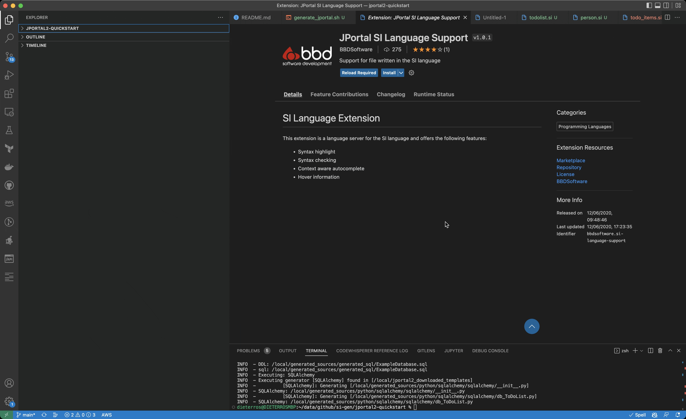

## Getting started with JPortal2

This tutorial assumes that the latest version of JPortal2 is [installed](../Overview/installing-jportal2.md#Docker) and ready to use, via the cross-platform Docker image. 

### Initial Setup

#### Installing VS Code and the JPortal plugin

For this tutorial, we recommend using VSCode (https://code.visualstudio.com/. You can use any editor, but VSCode is a free, platform-independent editor 
with a rich ecosystem of plugins and functionality, specifically a JPortal2 plugin which gives code completion 
and syntax highlighting. We will be installing the VS Code plugin now.

First install VSCode from [here](https://code.visualstudio.com/)  

To install the JPortal extension, open VSCode, then choose the the Extensions tab on the left (Or press Ctrl-P and type "install extensions"). Type "JPortal" 
into the search field, choose the JPortal extension, and install it. See the video below:



It is on the todo list to have the VSCode plugin do a compile task, but for now, you can set up VSCode to compile your si, using a tasks.json file 
inside the .vscode directory in your project. Once set up, you can press Ctrl-Shift-B to run, or set it up with other keys.

Instructions on how to set up tasks in VSCode are [here](https://code.visualstudio.com/docs/editor/tasks)  

Below is an example tasks.json file that will work for this demo:

```json
{
  // See https://go.microsoft.com/fwlink/?LinkId=733558
  // for the documentation about the tasks.json format
  "version": "2.0.0",
  "tasks": [
    {
      "label": "JPortal2",
      "type": "shell",
      "command": "./generate_jportal.sh",
      "windows": {
        "command": "wsl .\\generate_jportal.sh"
      },
      "options": {
        "cwd": "${workspaceFolder} "
      },
      "problemMatcher": [],
      "group": {
        "kind": "build",
        "isDefault": true
      }
    }
  ]
}
```

To easily test our JPortal project against different databases, we will use docker-compose to start up some test databases. You can install a database 
directly on your OS, but we are big fans of containers for local testing, so this tutorial assumes you are using docker-compose.

#### Installing docker-compose
Install docker-compose using the instructions [here](https://docs.docker.com/compose/install/)  
