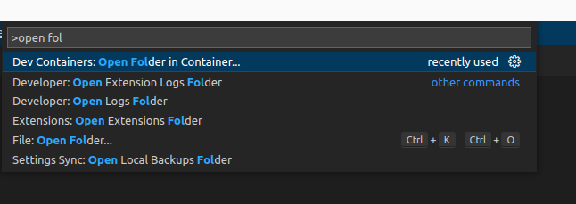

# Setting up your tutorial environment

For this tutorial, we recommend using VSCode. You can use any editor, but VSCode is a free, platform-independent editor
with a rich ecosystem of plugins and functionality, specifically a JPortal2 plugin which gives code completion
and syntax highlighting. Furthermore, VSCode supports the concept of
[Dev Containers](https://code.visualstudio.com/docs/devcontainers/containers).

A Dev Container allows us to very easily set up a dev environment on a local dev machine, on any OS, by making use of 
containers.

We have created a VSCode project for this tutorial, which includes a dev container. The dev container is preconfigured 
with all the tools and extensions needed to complete this tutorial, as well as all the files created in the following 
tutorial sections. We strongly recommend you just clone the tutorial repo below, and use that.

If you absolutely insist on doing things manually, you can follow along with the instructions, but you may run into
issues if you have typos or misread the instructions. Caveat Emptor!

## Cloning the tutorial repo (aka "The Easy Way")
By far the easiest way to get started, is to just clone the tutorial repo at 
[https://github.com/SI-Gen/jportal2-quickstart](https://github.com/SI-Gen/jportal2-quickstart)

```shell
git clone https://github.com/SI-Gen/jportal2-quickstart.git
cd jportal2-quickstart
code .
```

The finally line `code .` tells VSCode to open the current directory.  

VSCode will start, and in all likelihood detect that the directory contains a dev container definition. If you don't 
already have the Dev Container extension installed, it will ask to install it, say yes.

Once the Dev Container extension is installed, VSCode will usually ask if you want to open the project in a container. 
If it doesn't, press Ctrl+Shift+P to open the command palette and start typing `open folder`. Choose the option 
`Dev Containers: Open folder in container` once it comes up.  




VS Code will download and build the dev container (if this is the first time you are running the tutorial).
Then it will restart and your project will be opened via the dev container. VSCode may also ask to install the relevant 
extensions. Say yes for all of them.

There! You're done! Skip the rest of this section!


## Do it manually (aka "The Hard Way")

### Installing JPortal2, VSCode and languagess and databases
This tutorial assumes that the latest version of JPortal2 is [installed](../Overview/installing-jportal2.md#Docker) 
and ready to use, via the cross-platform Docker image.  
It also assumes you've installed the [JPortal VSCode plugin](../Overview/installing-vscode-jportal2-extension.md)  
Lastly it assumes you have all the required databases and languages installed, depending on which languages and 
databases you want to work with in the tutorial. We will not be talking you through how to install Postgres, SQL Server,
C#, Python etc in this tutorial. 

