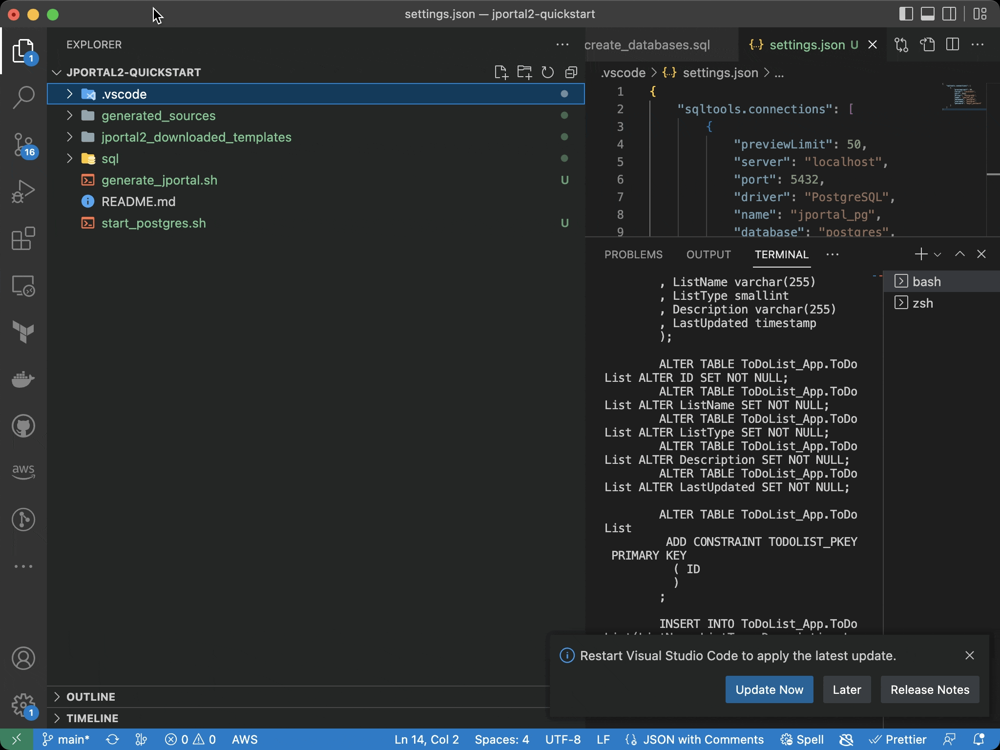

## Setup the project directory

**You can read through this section for background if you cloned the tutorial repo, but all of the below steps have 
been done for you.**

### Directory setup
Now we are ready to create our project.

Create a new directory called `jportal2-tutorial`. This will be the root directory of your project.  

Inside the root directory, create directories called `sql/si`. The name of this directory is completely up to you, you can put JPortal files anywhere you want in your project, but to make the demo easier to follow, we suggest following our structure.  

Your directory structure should now look like this:
```
jportal2-tutorial
└───sql
    └───si
```

### Installing the SQLTools extension

To interact with our test databases, we need an admin tool. There are many available and you can use any one you like,
but to keep this tutorial simple and standard, we're going to install a VSCode extension called SQLTools.

To install the SQLTools extension, choose the Extensions tab on the left (Or press Ctrl-P and type "install extensions").
Type "SQLTools" into the search field, choose the `SQLTools` extension (the one by Mattheus Teixeira), and install it.
Also install the `SQLTools PostgreSQL/Cockroach/Redshift Driver` extension if you plan to use Postgres, as well as the
additional `SQLTools Microsoft SQL Server/Azure Driver` if you want to use SQL Server.

See the video below:



Now, let's set up a file which contains the connection info to a local postgres database. Create a directory called .vscode
and in there, create a file called settings.json

**.vscode/settings.json**
```json
{
  "sqltools.connections": [
    {
      "previewLimit": 50,
      "server": "localhost",
      "port": 5432,
      "driver": "PostgreSQL",
      "name": "jportal_postgres",
      "database": "postgres",
      "username": "postgres",
      "password": "magic_password"
    }
  ]
}
```

Your directory structure should now look like this:
```
jportal2-tutorial
└───.vscode
    └── settings.json
└───sql
    └───si
```

